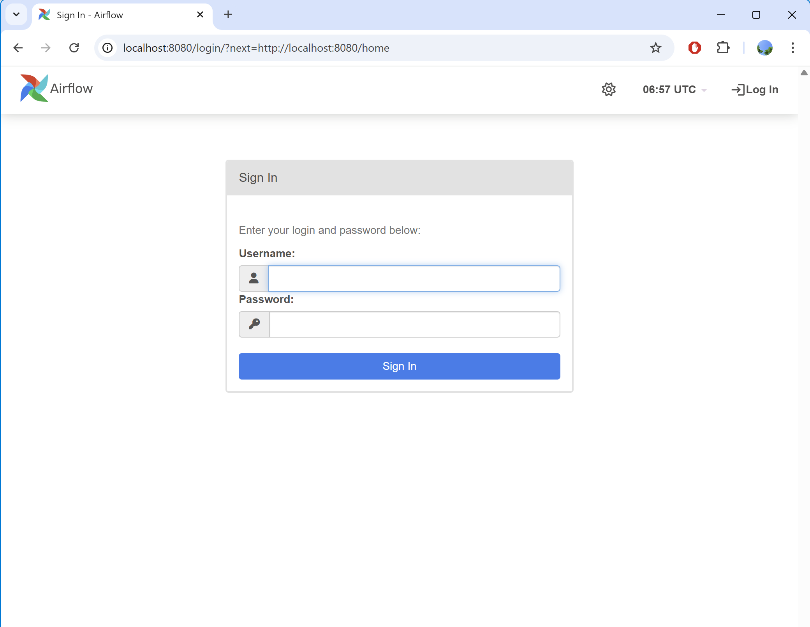

- BMKG Daily Weather Data Dashboard built with Streamlit/Python
Link to dashboard: https://salmiahls-bmkg-weather-data-dashboard.streamlit.app/

- BMKG Daily Weather Data Pipeline with Airflow and PostgreSQL (built with Docker) 

