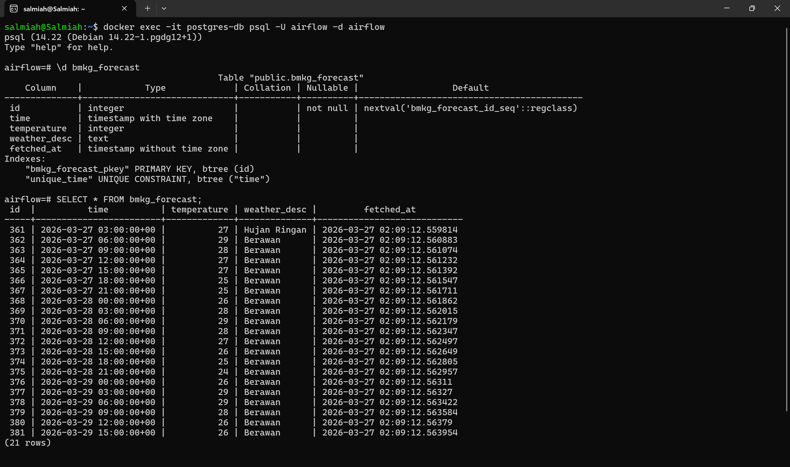

### BMKG Daily Weather Data Dashboard built with Streamlit/Python
Link to dashboard: https://salmiahls-bmkg-weather-data-dashboard.streamlit.app/

### BMKG Daily Weather Data Pipeline with Airflow and PostgreSQL (built with Docker) 
<figure>
  
  <figcaption>Airflow Login Page</figcaption>
</figure>
  
<figure>
  
  <figcaption>Airflow-PostgreSQL fetched data</figcaption>
</figure>
